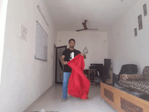

##  05_Image_segmentation

隐形斗篷！！！

- [ref1](https://www.learnopencv.com/invisibility-cloak-using-color-detection-and-segmentation-with-opencv/)

基本思路如下：

- 捕获并存储背景框架。
- 使用颜色检测算法检测红色布料。
- 通过生成蒙版将红色布块分割出来。
- 生成最终的增强输出以创建神奇效果。

整个效果流程图如GIF所示！

